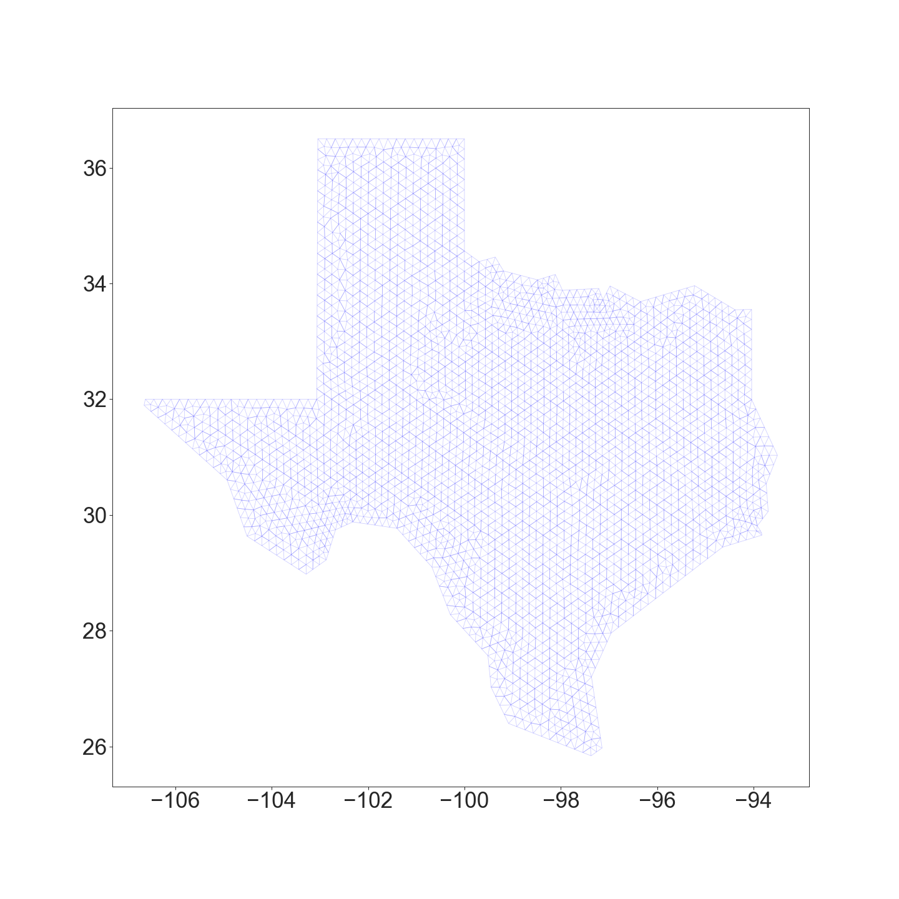
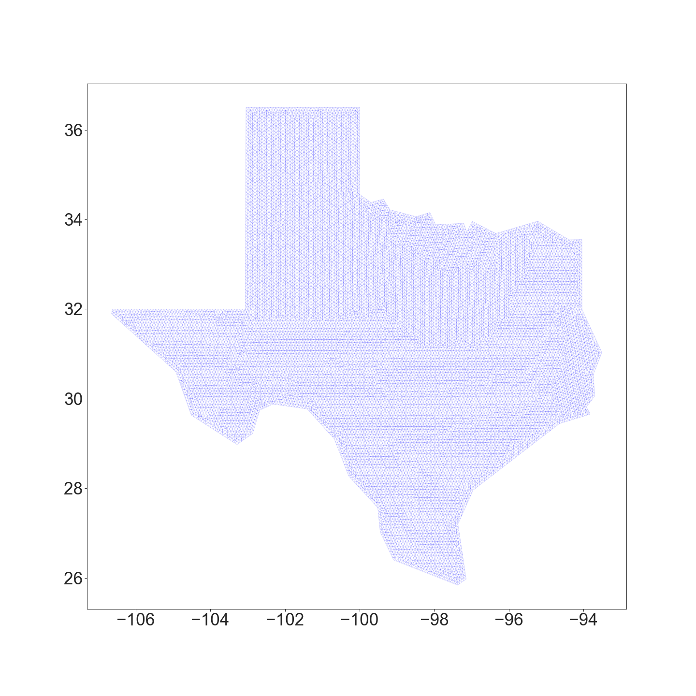
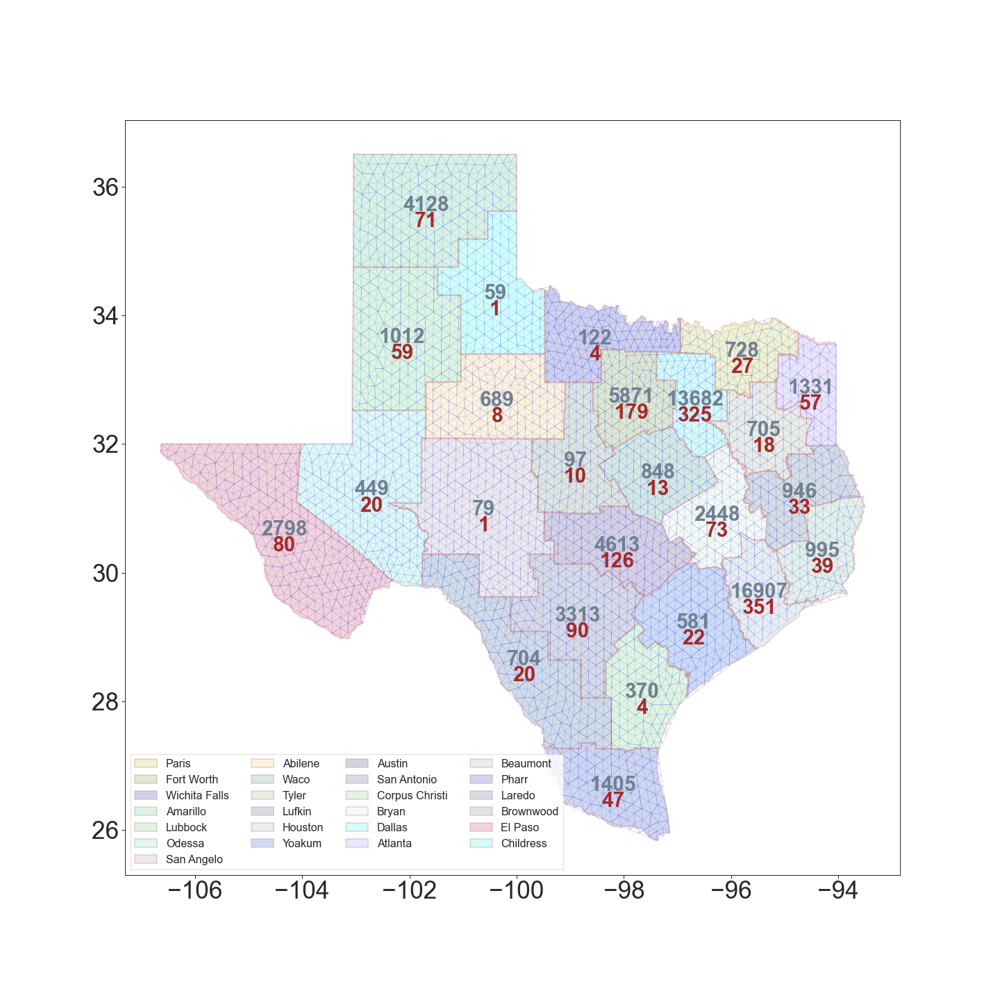
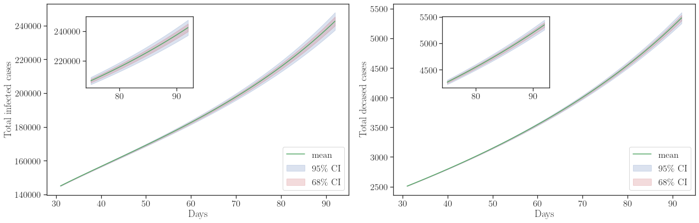
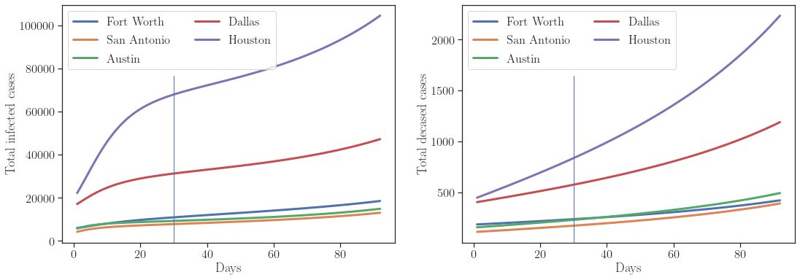
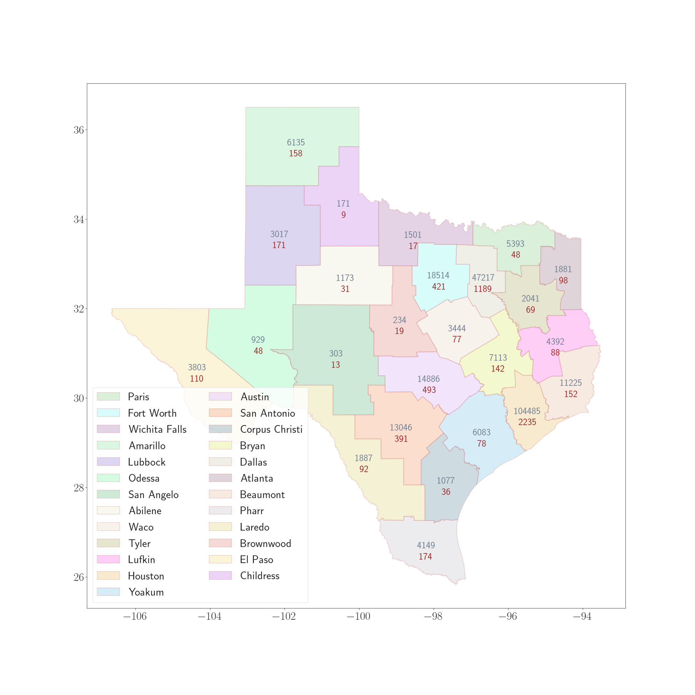

# BayesForSEIRD

Public repository containing code and data for [paper](https://doi.org/10.1007/s00466-020-01889-z)

> Jha, P.K., Cao, L. & Oden, J.T. Bayesian-based predictions of COVID-19 evolution in Texas using multispecies mixture-theoretic continuum models. *Comput Mech* (2020). https://doi.org/10.1007/s00466-020-01889-z

Download paper from [here](https://prashjha.github.io/publication/jha-2020-seird/Jha-2020-seird.pdf).

## Introduction
We model the spread of COVID-19 infection in Texas using PDE based SEIRD model. The model describes the evolution of spatially changing susceptible, exposed, infectitious, recovered, and deceased fraction of population. The model is discretized using finite element approximation and implicit Euler scheme. At each time step, we perform fixed point iteration to solve the coupled equations, see paper for more details. The solver is implemented using [FEniCS](https://fenicsproject.org/).

To infer for the model parameters and to check the validity of the model, we employ the Bayesian inference in OPAL (Occam Plausibility Algorithm), see [Oden et al 2017](https://onlinelibrary.wiley.com/doi/abs/10.1002/9781119176817.ecm2101) and [Oden 2018](https://doi.org/10.1017/S096249291800003X). The model parameters are inferred using the total number of infected and deceased cases in Texas. The results show that the model is invalid for the prediction of the infected cases and is *Not Invalid* for the prediction of the deceased cases.

For Bayesian inference, [hIPPYlib](https://hippylib.github.io/) library is used. In particular, the preconditioned Crank-Nicolson (pCN) algorithm in hIPPYlib is utilized for generating samples of posterior. 

## Structure of repository

### PreProcess

- texas_map: Reads shapefile that is obtained by simplyfying the actual Texas map shapefile in QGIS software and uses gmsh to discretize the map

Coarse mesh  |  Fine mesh
:-------------------------:|:-------------------------:
   |   

- district_data: Reads district shapefile and collects key information such as district indices and names, counties in each district, and polygon describing the district

- county_data: Reads county shapefile and collects key information such as county indices and names. This also computes the county area and centroid of county (this information is used in setting up initial condition for the SEIRD model). Notebook file also has some example of plotting data over county map

- covid_data: Reads the COVID-19 data downloaded from [source](https://www.dshs.texas.gov/coronavirus/additionaldata/). Notebook `Process data include active cases.ipynb` processes the data file and extracts COVID-19 data district-wise and county-wise and also total cases data over Texas state. Notebook `Plot data over triangulation.ipynb` contains some plotting methods



### Data

- covid_7July2020: latest processed data used in the paper

- geography: fixed data such as county names, district names, list of counties in each district, total population in each county (extracted from the raw data from the source)

- mesh: Various mesh files

### Model

- seird: SEIRD model and mcmc functions

- ic_results: Generate initial condition once for a given mesh and store it in this directory

- subdomains: Generate district subdomain information once and store in this directory. District subdomain information is used to compute the number of cases in each districts. This directory also contains notebook which shows how to create subdomains in fenics

### Results

- calibration_results: Contains mcmc results for different chains, the bash script used to run the mcmc, and notebook for visualization

- validation_results: Contains mcmc results for different chains, the bash script used to run the mcmc, and notebook for visualization. Notebook also contains functions which read and visualize prediction results

- prediction_results: Contains prediction qoi, bash script, and notebook for visualization. To use the notebook and qoi results, first join the smaller files `qoi_0.npy`, `qoi_1.npy`, ..., `qoi_4.npy` into single `qoi.npy` file using split_and_join.py script

- sensitivity: Results of sensistivity study for different parameter space and notebook to study the results

## Some results

### Validation results
The model was found to be invalid for the prediction of the total infected cases, however, is found to be adequate for the prediction of the total deceased cases. 

### Prediction results

- By September 1, we predict to see about **7003** fatalities and **301658** infected cases. Uncertainties, in terms of the standard deviation of the QoI distribution, in deceased and infected cases are about **102** and **5786**. 

> These calculations are based on the COVID-19 data upto 30 June 2020. It is now clear that the model has underestimated the deceased cases even though it was found to be valid. This motivates us to look further into the model. It is also possible that the upward trend of deceased cases was not strong in the data. 

- Prediction results for total infected and deceased cases in Texas starting from 1 July till 1 September 2020



- Projection of cases in top five districts. Predition period is 1 July 2020 - 1 September 2020




- Projection of total cases in 25 districts on August 15 (left) and September 1 (right). Red corresponds to the deceased cases and grey corresponds to the infected cases

15 August 2020  |  1 September 2020
:-------------------------:|:-------------------------:
   |   

## Dependencies
Create new conda environment as follows:

```sh
conda create --name confen python=3.7
conda activate confen
```

Dependencies and their installation:

- Fenics: For forward model solver
```sh
conda install -c conda-forge fenics
```

- hIPPYlib: For MCMC sampling
```sh
pip install hippylib
```

- SALib: For sensitivity
```sh
pip install SALib
```

- geopandas: For reading and manipulating shapefile
```sh
pip install geopandas
```

- seaborn, descartes, pyvista, psutil
```sh
pip install seaborn descartes pyvista psutil
```

## Remark

- We have moved this code from private repository and modified some files, directory names, and relative position of directories. This may cause some notebooks to not function properly. This will be corrected in due course of time.

- If you have some ideas and want to collaborate, reach out to us (see contact details below). If you have any question about method or model, feel free to get in touch.

## Contributors

- Prashant K. Jha (pjha.sci@gmail.com)
- Lianghao Cao (lianghao@ices.utexas.edu)
